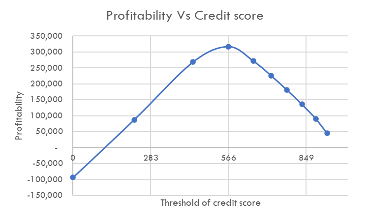

# Microfinance Credit Scoring tool

## Introduction
There has been a rapid growth of fintech in the past, with the majority of them playing in the credit space. This has provided benefits to the ecosystem in two ways, first, the borrowers have easy access to funds to enable them to actualize their dreams. Secondly, the investors have been extended an opportunity to invest their money for a small return in the society in which they live.
That notwithstanding, there exists a real risk of some borrowers failing to pay back. It therefore became necessary to develop a simple tool to help microfinance determine the credit score of each borrower; that way, borrowers would be advanced credit commensurate to what they are able to pay. Further, if a borrower's credit score is below the acceptable score, then credit approval would require approval from a senior official.
Leveraging the power of Machine learning, the availability of data, and experienced staff, the project was able to deliver its goals. In our initial effort, our Logistic Regression model achieved accuracy score of 0.84, reflecting a promising start of this project. We then embarked on model optimization, delivering a slight model accuracy score of 0.88.
Our model reveals that the minimum credit score that would deliver optimal return is 537/1000

## Key Objectives
Our primary goal is to develop a model that accurately predicts a borrower's credit score. By improving forecast accuracy, we aim to reduce losses through default, thereby enhancing the profitability of the investor as well as borrower's experience.

## Data Source
All data for this project was obtained from [Kaggle](https://www.kaggle.com/datasets/kapturovalexander/bank-credit-scoring/bank.csv). 

## Methodology
We took the following steps:
  1. Import data and seeking to understand it.
  2. Data preprocessing and cleaning.
  3. Feature engineering
  4. Exploratory Data Analysis (EDA).
  5. Model development (Logistic Regression) and optimization (RandomSearchCV)
  6. Model evaluation (classification report, precision, recall, F1-score, and Accuracy).

## Model Architecture
Our model was primarily Logistic Regression which was later optimized to give a higher evaluation score. This model was preferred because it is a powerful binary algorithm that also gives probabilities as an output.

## Training and Evaluation
- **Penalty:** We used L2
- **Inverse of regularization strength:** We used 1.0
- **Solver:** = lbfgs
- **RepeatedStratifiedKFold** to resolve for data imbalance

## Conclusion
- Our approach resulted in accurate prediction of Credit Score (ranging from 0 to 1000)
- We determined that the minimum credit score to qualify for a credit is 566 (Higher is better)
- This project has the potential to reduce non-performing credit significantly as well as open the facility to other borrowers who would otherwise be left out

  

## Future work
Future work may include:
- Perform further model optimization to improve accuracy.
- Making better model architecture.
- Continuous model evaluation after deployment.

## Acknowledgemet
I would like to express my gratitude to Kaggle and those who provided this dataset.

Additionally, thank you for visiting my project repository, I am excited to share more data-driven insights in future!

## Contributions
Contributions are welcome! If you would like to contribute to this repository, please follow the guidelines outlined in [CONTRIBUTIONS](https://github.com/MosesMwalya/bank_credit_scoring/blob/main/CONTRIBUTIONS.md) 

Any improvements, bug fixes, or additional projects are greatly appreciated.

## LICENSE
This project is licensed under the [MIT License](https://github.com/MosesMwalya/bank_credit_scoring/blob/main/LICENSE.md). You are free to use the code and resources for educational or personal purposes.

## Feedback and Contact
I welcome any feedback, suggestions, or questions you may have about the projects or the repository. Feel free to reach out to me via [my email](moses.mutua@gmail.com)

Enjoy exploring my data science projects!

